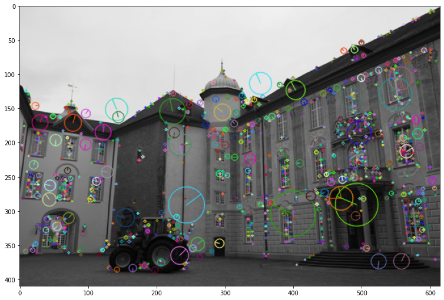

The entire pipeline consists of different parts -
1) Using optical flow to get point correspondences and estimate depths.

Optical flow is computed first. The smallest singular value of spatiotemporal derivative matrix is calculated and only those pixels which are above a threshold value are considered. the flow vectors are shown below 

Epipoles after RANSAC and satisfying planar condition equation by a threshold

Depths are then calculated by assuming pure translational motion

2) Reconstruction of 3d scene from 2 views using 2 view sfm

We first identify important features using SIFT -

We then match key points using both least square and RANSAC to prove effectiveness of ransac -

The resulting epipolar lines are as follows 

Finally we reproject the points of one image onto the other

3) Lastly we recreate the 3D model from multi view sfm

Input views - 

Disparity -

Disparity and depth after post processing -

L-R Consistency check mask -

Reconstructed 3d model from 2 views using ZNCC Kernel -

Entire Reconstructed 3d model

