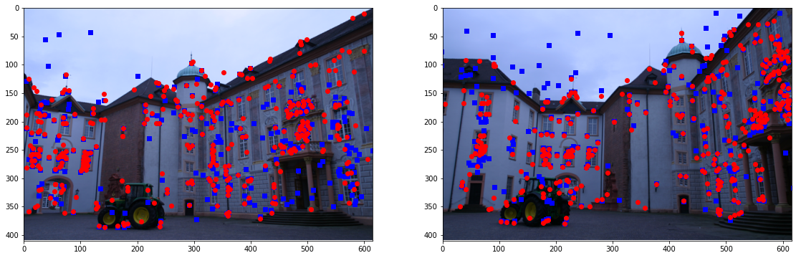

The entire pipeline consists of different parts -
1) Using optical flow to get point correspondences and estimate depths.
2) Reconstruction of 3d scene from 2 views using 2 view sfm

We first identify important features using SIFT -

We then match key points using both least square and RANSAC to prove effectiveness of ransac -

The resulting epipolar lines are as follows 

Finally we reproject the points of one image onto the other

Lastly we recreate the 3D model from multi view sfm
